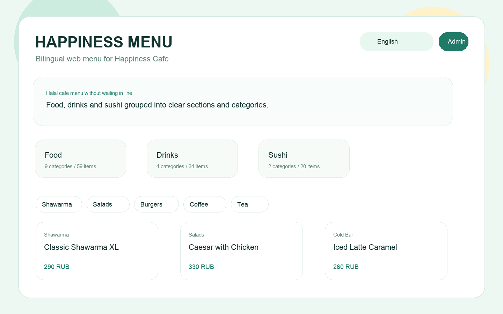
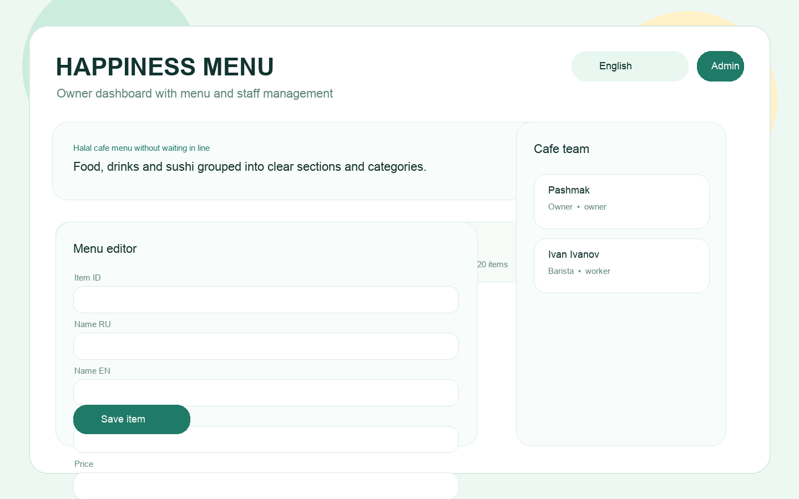

# Happiness Menu

Bilingual web menu and lightweight staff panel for Happiness Cafe.

## Demo




## Product Context

- End users: Innopolis University students, staff, and campus visitors who want to check the Happiness Cafe menu before reaching the counter.
- Problem: People lose time in line while deciding what to order, and the menu is not always convenient to browse quickly on a phone.
- Solution: A small web product with a bilingual menu browser and a role-based staff panel for updating items without editing code.

## Features

Implemented:

- Bilingual public menu in Russian and English
- Menu browsing by section and category
- Search across menu items
- Highlighted popular items
- FastAPI backend with PostgreSQL
- React frontend for end users
- Role-based admin panel
- Owner and worker roles
- Worker management for the owner
- Docker Compose deployment with Caddy reverse proxy

Not yet implemented:

- Real image gallery for each item
- Rich item editing with image upload
- Analytics dashboard for the most viewed categories
- Password reset flow for staff

## Usage

### Public user

1. Open the web app.
2. Choose Russian or English.
3. Select a section: Food, Drinks, or Sushi and Rolls.
4. Open a category and browse current positions.
5. Use the search field to quickly find a specific item.

### Staff

1. Open `Admin Panel`.
2. Sign in with staff credentials.
3. Add, update, or remove menu items.
4. If you are the owner, also manage workers.

Demo credentials:

- Owner: `owner / owner123`
- Worker: `worker1 / worker123`

## Public Access

- Telegram bot version: `@HappinessMenuBot`

## Deployment

Target OS:

- Ubuntu 24.04

Required software:

- Docker
- Docker Compose plugin

Step-by-step deployment:

1. Clone the repository.
2. Create `.env` from `.env.example`.
3. Update `AUTH_SECRET` before production deployment.
4. Run:

```bash
docker compose up --build -d
```

5. Open the product at `http://<server-ip>:8080`.
6. Open API docs at `http://<server-ip>:8080/docs`.

## Local Development

Backend:

```bash
cd backend
PYTHONPATH=src uv run uvicorn happiness_backend.main:app --host 0.0.0.0 --port 8000 --reload
```

Frontend:

```bash
cd frontend
npm install
npm run dev
```
